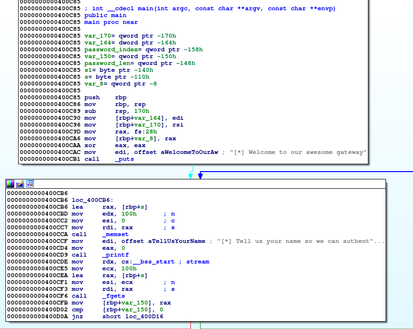
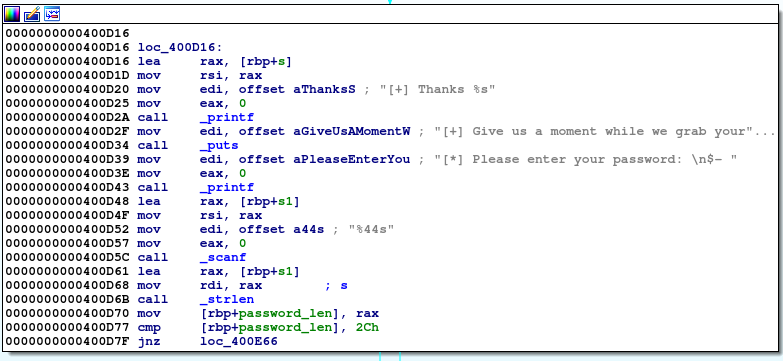
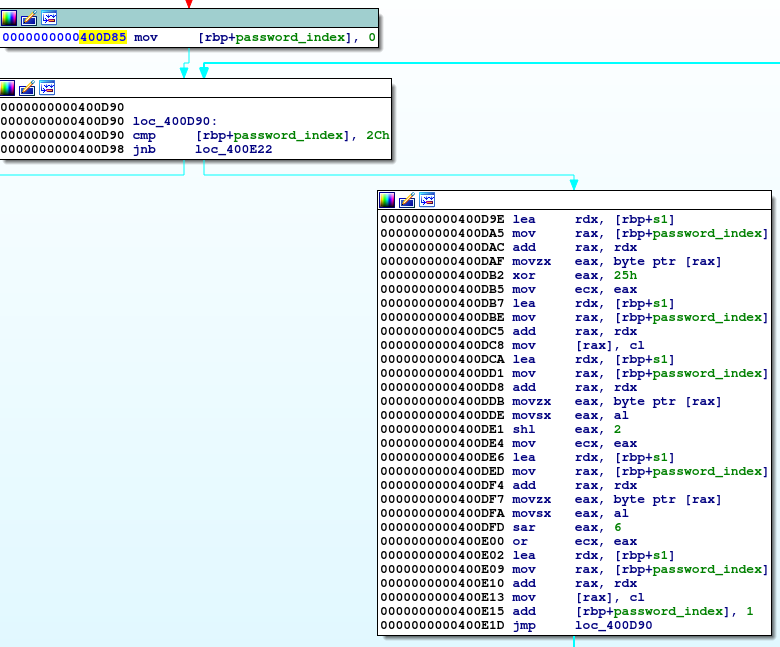
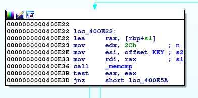
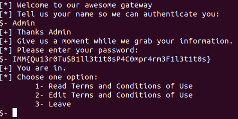

# Solving Immunity Inc Ekoparty 2018 CTF challenge: Awesome Gateway (xdev190)

## Introduction

During the last year's Ekoparty, We<sup>1</sup> had the chance to play **(and win!)** the CTF game organized by the cool team from [Immunity Inc](https://www.immunitysec.com/ "Immunity Inc").

I wasn't able to take a look at this challenge before, as it was solved by another member of our team. I did a quick search and I didn't find any write up for it, so I've solved it again :).

I've uploaded the challenge to the repository just in case you want to try it.

**sha1sum gateway:** 36a0597f6eee6ea132972e6f3ca4933f970a28f3

<sup>1</sup>Twitter: @partu18, @tincho508, @_1ggy, @6e726d, @nahueldsanchez\_, @\_samelat

## Solution

First I've started taking a look at what we were given:

~~~~shell
file gateway

gateway: ELF 64-bit LSB executable, x86-64, version 1 (SYSV), dynamically linked, interpreter /lib64/ld-linux-x86-64.so.2, for GNU/Linux 2.6.32, BuildID[sha1]=1fc5d225fb65ef57d7e2c416b3839ded8b5eeb19, not stripped
~~~~

We have a 64-bit binary with symbols. That's cool. Let's analyze it with. I've used the IDA Pro free version.

_Disclaimer: I've run this binary in a virtual machine, just in case, you never know what things could happen when you run code given by these folks :)._

### Analyzing the binary with IDA Pro

Once I've loaded the binary I took a look at the main function.



As we can see, We are greeted with a welcome message, and later We need to provide a username. The only thing that's validated against this username it's the length. It must be different than 0, that means that the username can't be empty.

If we provide a username the following path is taken:



As it's possible to see, the program expects a 44 bytes string that will be the "password". This is checked at address 0x400D77. If the condition is fulfilled we'll land in the following basic block, at address 0x400D85.



Here a counter is initialized. This counter will be used to iterate over all bytes of our password. Once that iteration is over the password will be compared against a key as shown below:



You can double click on the "KEY" word and you'll be able to find the following bytes:

`
0xB1,0xA1,0xA1,0x79,0xD1,0x41,0x50,0x58,0x5D,0x54,0xC5,0x41,0x04,0x9D,0x50,0x25,0x25,0x58,0x45,0x50,0x45,0x54,0x59,0xD5,0x44,0x99,0x54,0x21,0x55,0x5D,0x44,0x5D,0x21,0x58,0x8D,0x50,0x25,0x58,0x45,0x50,0x45,0x54,0x59,0x61
`

Let's see what happens with each character of our password. The following instructions are executed:

~~~~asm
.text:0000000000400D9E lea     rdx, [rbp+s1]
.text:0000000000400DA5 mov     rax, [rbp+password_index]
.text:0000000000400DAC add     rax, rdx
.text:0000000000400DAF movzx   eax, byte ptr [rax]
.text:0000000000400DB2 xor     eax, 25h
.text:0000000000400DB5 mov     ecx, eax
.text:0000000000400DB7 lea     rdx, [rbp+s1]
.text:0000000000400DBE mov     rax, [rbp+password_index]
.text:0000000000400DC5 add     rax, rdx
.text:0000000000400DC8 mov     [rax], cl
.text:0000000000400DCA lea     rdx, [rbp+s1]
.text:0000000000400DD1 mov     rax, [rbp+password_index]
.text:0000000000400DD8 add     rax, rdx
.text:0000000000400DDB movzx   eax, byte ptr [rax]
.text:0000000000400DDE movsx   eax, al
.text:0000000000400DE1 shl     eax, 2
.text:0000000000400DE4 mov     ecx, eax
.text:0000000000400DE6 lea     rdx, [rbp+s1]
.text:0000000000400DED mov     rax, [rbp+password_index]
.text:0000000000400DF4 add     rax, rdx
.text:0000000000400DF7 movzx   eax, byte ptr [rax]
.text:0000000000400DFA movsx   eax, al
.text:0000000000400DFD sar     eax, 6
.text:0000000000400E00 or      ecx, eax
.text:0000000000400E02 lea     rdx, [rbp+s1]
.text:0000000000400E09 mov     rax, [rbp+password_index]
.text:0000000000400E10 add     rax, rdx
.text:0000000000400E13 mov     [rax], cl
.text:0000000000400E15 add     [rbp+password_index], 1
.text:0000000000400E1D jmp     loc_400D90
~~~~

First, a byte is moved to eax (0x400DAF) and treated as an unsigned int. This byte then, is XORed against the value 0x25. That result is stored in ECX.

This new value will replace the actual character of our password (at address 0x400DC8), and will be loaded again at EAX (0x400DDB), but this time, in the next line it will be treated as a SIGNED int, being sign extended with 0's or 1's depending on the value of the MSB. (instruction MOVSX).

Once the value it's loaded at EAX it will be shifted to the left 2 places and stored at ECX for later use.
Our previous value (the result of the XOR operation which replace our character of the password) will be loaded again as a signed value at address 0x400DFA but this time will be shifted to the right 6 places and finally ORed against the value previously stored at ECX.

That result is the one which will be compared against the hardcoded key.

Let's do a real example step by step to understand it better:

I'll use a value called X, represented in binary, going from X7 to X0:

X = _X7 X6 X5 X4 X3 X2 X1 X0_

The first operation performed it's the **XOR** with 0x25, 00100101 in binary. After performing this operation I'll have 8 new bits which I'll call **Z7 to Z0** where:

Z7 = X7 _(as X7 was xored against 0_)

Z6 = X6 _(as X7 was xored against 0_)

Z5 = X5 XOR 1 _(This means that the value of Z5 will be the X5 XOR 1)_

Z4 = X4

Z3 = X3

Z2 = X2 XOR 1

Z1 = X1

Z0 = X0 XOR 0

OK, having this part solved the following thing for me was trying to understand what was happening at bit level after all the instructions were executed. First I made the assumption that the byte that I used was negative, that means **Z7 = 1**. 

Based on this assumption at address 0x400DDE things get interesting, let's see why:

When the MOVSX instruction it's executed as the MSB is 1 our number will be sign extended adding 1's being stored like this at EAX:

EAX = 1 1 1 1 1 1 1 1 **Z7 Z6 Z5 Z4 Z3 Z2 Z1 Z0**

Now remember that with this new value two operations are performed **SHL EAX, 2** and **SAR EAX, 6**

Let's see what happens:

SHL EAX, 2 = 1 1 1 1 1 1 **Z7 Z6 Z5 Z4 Z3 Z2 Z1 Z0** 0 0

SAR EAX, 6 = 1 1 1 1 1 1 1 1 1 1 1 1 1 1 **Z7 Z6**

As explained above, once we've these two values and OR is performed, but as it possible to see due to the fact that almost all bits are 1's after the SAR operation the result of the OR will only depend on the values of **Z7 Z6** that are ORed against 0, but remember that **Z7 must be 1**, as in other case the MOVSX will be different, so the only bit that can change it's **Z6**.

With this information we can conclude something: **If the key that we've to find has some negative number, some of the bytes that compose it will have to have almost all bits set to 1. Otherwise we can know that the key doesn't have any negative value.

Let's check the 44 bytes in binary:

```
0xb1 = 10110001  0xa1 = 10100001  0xa1 = 10100001

0x79 = 01111001  0xd1 = 11010001  0x41 = 01000001

0x50 = 01010000  0x58 = 01011000  0x5d = 01011101

0x54 = 01010100  0xc5 = 11000101  0x41 = 01000001

0x04 = 00000100  0x9d = 10011101  0x50 = 01010000

0x25 = 00100101  0x25 = 00100101  0x58 = 01011000

0x45 = 01000101  0x50 = 01010000  0x45 = 01000101

0x54 = 01010100  0x59 = 01011001  0xd5 = 11010101

0x44 = 01000100  0x99 = 10011001  0x54 = 01010100

0x21 = 00100001  0x55 = 01010101  0x5d = 01011101

0x44 = 01000100  0x5d = 01011101  0x21 = 00100001

0x58 = 01011000  0x8d = 10001101  0x50 = 01010000

0x25 = 00100101  0x58 = 01011000  0x45 = 01000101

0x50 = 01010000  0x45 = 01000101  0x54 = 01010100

0x59 = 01011001  0x61 = 01100001
```

AS we can see, we don't have any byte with 6 1's in it. We know that the key doesn't have any byte with the MSB set at 1. Let's see what happens when the MSB (or Z7) is 0:

SHL EAX, 2 = 0 0 0 0 0 0 **Z7 Z6 Z5 Z4 Z3 Z2 Z1 Z0** 0 0

SAR EAX, 6 = 0 0 0 0 0 0 0 0 0 0 0 0 0 0 **Z7 Z6**

Also remember that Z7 must be 0, so the only "free" bit in the SAR operation is Z6. Our final OR operation will be with the following values:

```
Z5  Z4  Z3  Z2  Z1  Z0  0  0

 0   0   0   0   0   0  0 Z6
```
I've noticed some interesting thing here, as the second bit (from right to left) is 0 in both cases all bytes in the key must had that bit at 0 (or I did something wrong). I've checked that and luckily all bytes had that particularity.

OK! now we've all the information to solve the problem. We know how to "build" each byte of the key as we know what happens with each bit as its exact position.

Let's see an example, finding the required value for the first byte of the key (0xb1):

0xB1 = 10110001

```
    Z5    Z4    Z3    Z2     Z1    Z0    0    Z6
     1     0     1     1      0     0    0     1
```

Based on our previous table, that connects the values of Z with X we can deduce the values for X:

```
X5 = 0

X4 = 0

X3 = 1

X2 = 0

X1 = 0

X0 = 1

 0 = 0

X6 = 1
```
Our final number is: 0 X6 X5 X4 X3 X2 X1 X0 =  **01001001**

I've wrote a simple python script to perform these operations for each byte of the key and I found the following flag:

```
IMM{Qu13r0Tu$B1ll3t1t0sP4C0mpr4rm3F1l3t1t0s}
```

Let's try it:



Challenged Solved!.

I hope that you enjoyed this writeup! I'll be trying to solve other challenges and continue writing. Stay tuned.